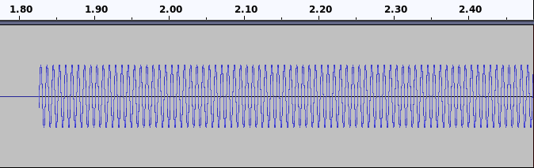
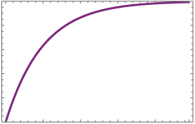
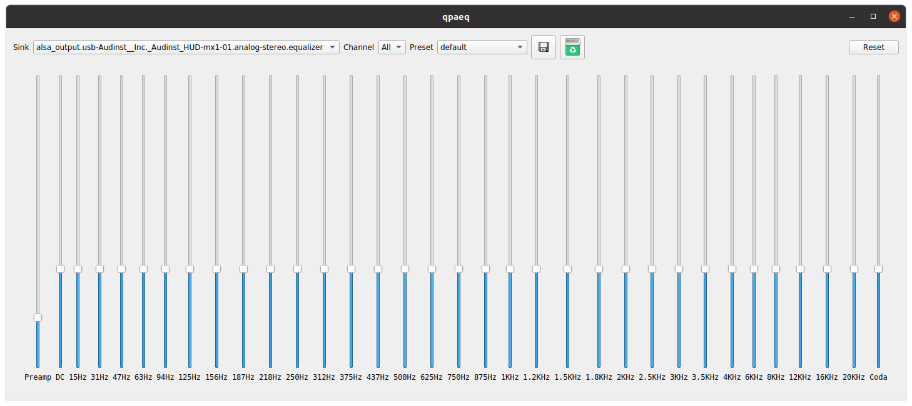
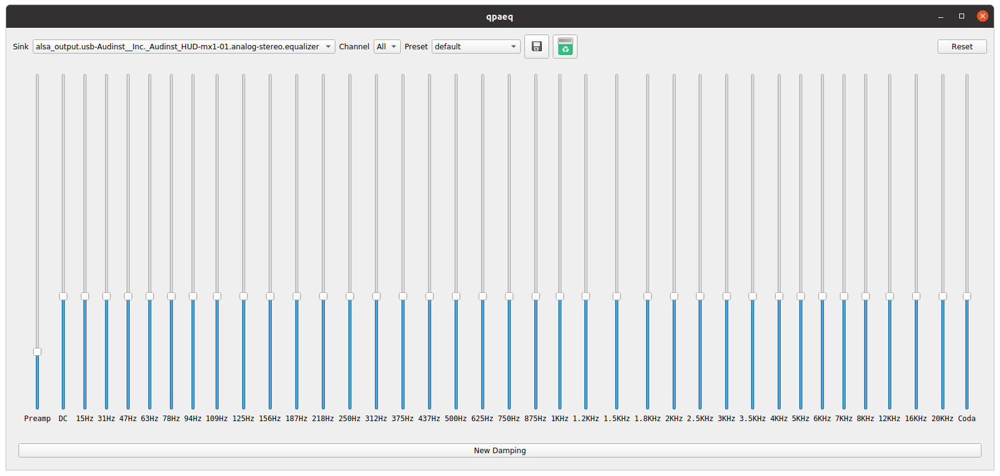
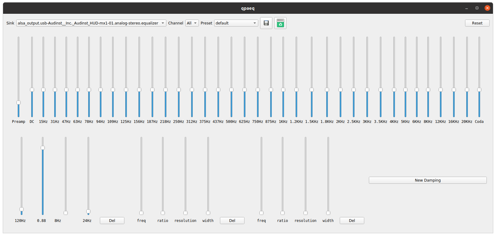
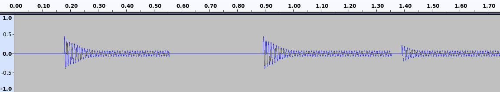

Dynamic equalization for pulseaudio aimed at standing wave cancelation (blurry, amplified bass sound).

To show how it works on played music, consider simple scenario when you are playing constant sound from speakers:

Fig. 1

You expect to hear exactly what is playing, but in reality, the sound is distorted by room characteristic.
Rooms have modes (resonances) - certain frequenicies, at which sound is amplified. In peak it could be as much as 30dB.

Overview of room response characteristic for constant speaker sound:

Fig. 2

To fight this effect, sound damping with characteristic reverse to room response can be applied.

This is oryqinal pulseaudio equalizer gui:

Fig. 3

And here is from this repo (there is new button - "New Damping"):

Fig. 4

Let's create three damping filters and initialize one of them:

Fig. 5

Test functionality, by playing 120Hz tone (or other in range 108Hz to 132Hz (width parameter)):

Fig. 6

As you can see I played sound from fig. 1 and muted it two times, which gave three 'sound regions': 1-muted-2-muted-3.

Region 1 - starts at full level and then filter attentuates it by ratio 0.88.
Muted - long enough to allow filter to recover.
Region 2 - behaves exactly like region 1.
Muted - short which allows filter to only partially recover (because room still produces sound).
Region 3 - starts at reduced level and then is attentuated to stable 'by 0.88' level.

